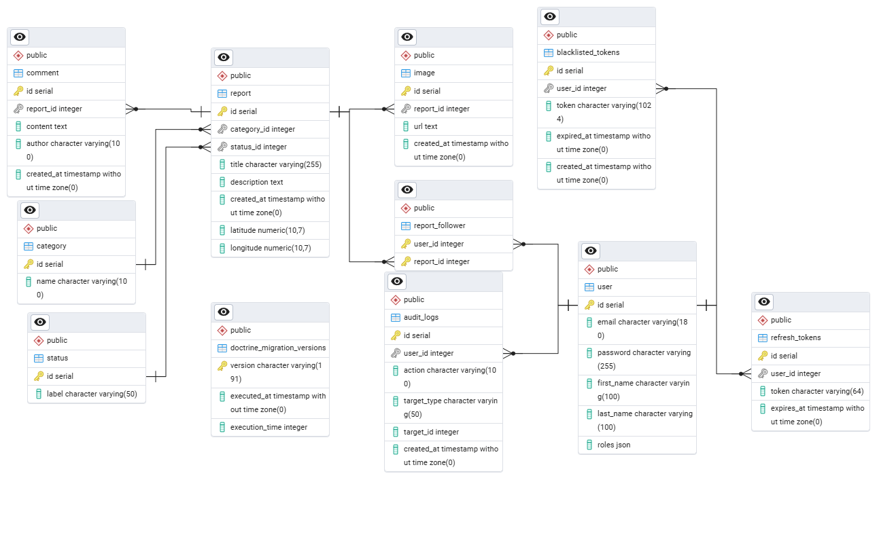

# FixOurCity

An application for reporting and managing city issues (e.g., potholes, illegal dumps, lighting failures).  
Allows residents to submit reports with photos, and the administration to review and handle them.

---

## Table of Contents

1. [Project Description](#project-description)  
2. [Architecture Diagram](#architecture-diagram)  
3. [Technologies](#technologies)  
4. [Installation and Setup](#installation-and-setup)  
5. [Database Structure (ERD)](#database-structure-erd)  
6. [Authors](#authors)  

---

## Project Description

FixOurCity is a full-stack application consisting of:
- **Frontend**: React 18 + Vite (with React Query and React-Leaflet)  
- **Backend**: Symfony 7 + Doctrine ORM + Messenger + RabbitMQ  
- **Database**: PostgreSQL  
- **Message Queue**: RabbitMQ (asynchronous tasks, e.g., email notifications)

A user can:
- register an account and log in (roles: `ROLE_USER`, `ROLE_ADMIN`),
- submit a new report (title, description, category, status, GPS coordinates, photo),
- browse the list of reports with support for pagination, filtering, and sorting,
- view the locations of issues on a map.

An administrator can additionally:
- edit and delete any report,
- manage users (change roles, view user data).

---

## Architecture Diagram

+-------------------+        REST API       +-------------------+        SQL/RabbitMQ
|    Frontend       |  <----------------->  |     Backend       | <-----------------+
|  (React + Vite)   |                       |   (Symfony 7)     |                   |
+-------------------+                       +-------------------+                   |
        |                                         |                                 |
        |----------------- HTTP(S) ---------------|                                 |
        |                                         |                                 |
        |<----------- WebSocket ------------------|                                 |
        |                                         |                                 |
        |                                         |---+----> PostgreSQL (DB)        |
        |                                         |   |                             |
        |                                         |   +----> RabbitMQ               |

---

## Technologies

### Backend

- **Symfony 7**  
  – A PHP framework, fast development cycle and built-in security mechanisms.  
- **Doctrine ORM**  
  – Entity management, migrations, and relationships; database organized in 3NF.  
- **Messenger + RabbitMQ**  
  – Queues for asynchronous operations (e.g., email notifications, long-running tasks).  
- **JWT + HttpOnly Cookies**  
  – Secure authentication and token refreshing.  
- **PostgreSQL**  
  – A high-performance, scalable relational database with index support.

### Frontend

- **React 18+ (Vite)**  
  – Modern, fast bundler; HMR; component-based structure.  
- **React Router v6**  
  – Client-side route management.  
- **React Query**  
  – Caching and synchronization of server state; automatic refetching.  
- **React-Leaflet**  
  – Displaying interactive maps (OpenStreetMap).  
- **CSS Modules / custom design system**  
  – Consistent styles, utility classes, responsiveness.

### DevOps

- **Docker + Docker Compose**  
  – Environment isolation, easy startup of services (backend, database, RabbitMQ).  
- **pgAdmin**  
  – GUI for managing the PostgreSQL database.

### Justification for the choice of technology

- **Symfony 7 (Backend)**  
  Symfony 7 was chosen as a modern PHP framework because of:  
  - **Stability and maturity**: Symfony has led the PHP ecosystem for years, with continuous development, a large community, and a rich package ecosystem. Version 7 introduces performance improvements, updated components, and enhanced security support.   
  - **Modularity and extensibility with Doctrine ORM**: Doctrine ORM ensures the database follows the third normal form (3NF), simplifies migrations, and manages entity relationships. This makes the domain model clear, and schema changes can be applied in a controlled way.  
  - **Messenger + RabbitMQ (Asynchronous tasks)**: Using RabbitMQ offloads long-running operations (e.g., email notifications) from the main request cycle and supports a scalable architecture. The Symfony Messenger component makes it easy to define queues and message consumers, resulting in a flexible, future-proof solution.

- **React 18 + Vite (Frontend)**  
  React 18 and Vite were selected because:  
  - **Reactivity and performance**: React 18 introduces concurrent rendering, allowing smoother UI updates even with many components. Vite offers extremely fast builds and hot module replacement (HMR), which accelerates the development cycle.  
  - **Component-based, scalable structure**: A component-driven approach helps separate concerns and encourages reuse of UI elements. React’s declarative style keeps code clean, which is essential for large and complex interfaces.  
  - **Modern state-management tools**: React Query simplifies data fetching and synchronization (caching, refetching, automatic updates), reducing the need for custom hooks or middleware. For CRUD-style API calls, React Query is more efficient than traditional Redux in many cases.  
  - **Integration with React-Leaflet**: To visualize reports on a map, React-Leaflet was chosen because Leaflet is a lightweight mapping library, and React-Leaflet provides native integration with React. This allows rendering an interactive map based on OpenStreetMap, which sufficiently covers the needs of locating city issues.  

- **Additional Tools and Solutions**  
  - **Docker + Docker Compose (DevOps)**: Using Docker containers for the backend, PostgreSQL database, and RabbitMQ broker guarantees that development and production environments are identical. This avoids “works on my machine” issues and speeds up onboarding new team members.  
  - **PostgreSQL**: The choice of PostgreSQL 17 was based on its stability and advanced indexing capabilities.   
  - **Swagger (API Documentation)**: Employing OpenAPI/Swagger ensures that frontend developers and external API consumers always have an up-to-date interactive view of available endpoints, requests, and responses.  
  - **Symfony Messenger**: The Messenger component streamlines queue and consumer configuration. With RabbitMQ integration, asynchronous tasks (e.g., welcome emails and image processing) can be added and monitored easily.

---

## Installation and Setup

> **Note:** The example assumes using Docker Compose. You can also run services manually, but the method below is recommended.

### Requirements

- Docker + Docker Compose  
- Node.js `>=18`  
- Composer (PHP)  

### Starting the application

```bash
git clone https://github.com/MaciejMalina/FixOurCity
cd fixourcity
start start.bat
```

Just run the .bat script (with docker running in the background)
Frontend available by default at [http://localhost:5173](http://localhost:5173)

### Access to developer tools

- **pgAdmin**: [http://localhost:5050](http://localhost:5050) (login and password in docker-compose)
- **RabbitMQ UI**: [http://localhost:15672](http://localhost:15672) (username: guest, password: guest)
- **Swagger (API docs)**: [http://localhost:8000/api/docs](http://localhost:8000/api/docs)

---

## ERD diagram



---

## Authors

- Maciej Malina


